<html><head><meta content="text/html; charset=UTF-8" http-equiv="content-type"></head><body class="c26">
Postgres &amp; Python

Eric D. Stevens

Git Repo: <a class="c8" href="https://www.google.com/url?q=https://github.com/Eric-D-Stevens/Employee_DB_Extension_PostgreSQL&amp;sa=D&amp;ust=1595560258275000&amp;usg=AOvVaw0zCpbxLpiHmLC3lKJeHp9Q">https://github.com/Eric-D-Stevens/Employee_DB_Extension_PostgreSQL</a>
<h2 class="c21" id="h.jle83cnevuw5">Outline</h2>
<a class="c8" href="#h.yucnyeu1hzl0">Background</a>: General information regarding the project 

<a class="c8" href="#h.x7jeun3yaish">The Story</a>: A playful story that allowed me to conceptualize the project

<a class="c8" href="#h.ugslnw43jjdr">Data Definition</a>: The extension to the database schema

<a class="c8" href="#h.f2zgzm9mnpk7">Data Engineering</a>: Python generation of dummy data to allow for testing

<a class="c8" href="#h.ejjh6c6qi72c">20 Questions</a>: 10 queries on the large original database, 10 leveraging the extension

<h2 class="c21" id="h.yucnyeu1hzl0">Background</h2>
This project starts out with a large pre-built database that I imported to the PSU server. I felt that integrating with a pre-existing database would be a very good exercise. I will not be including the full database in my git repo because it is several hundred megabytes and easily accessible elsewhere: The PostgreSQL implementation can be found here: <a class="c8" href="https://www.google.com/url?q=https://github.com/vrajmohan/pgsql-sample-data/tree/master/employee&amp;sa=D&amp;ust=1595560258276000&amp;usg=AOvVaw0vgL0Fa44YGNtBcLIGTca7">https://github.com/vrajmohan/pgsql-sample-data/tree/master/employee</a>. This repository is a port to Postgres from the original MySql implementation which can be found here: <a class="c8" href="https://www.google.com/url?q=https://github.com/datacharmer/test_db&amp;sa=D&amp;ust=1595560258277000&amp;usg=AOvVaw1AmqboaBO3O3HRVkYLfKP0">https://github.com/datacharmer/test_db</a>.

This project is focused on extending the existing schema with rational components that could hypothetically extend the functionality of the database. Much of the time spent on this project was focused on the effort to synthesize data that would result in logical relationships in the schema. The amount of time and effort that went into engineering the synthetic data may have taken away from implementing a more sophisticated database, the overall product of the work performs well and accomplishes what it intends to.

<h2 class="c21" id="h.x7jeun3yaish">The story</h2>
I am working for a large software company that has a huge database of its employees, which departments they work for, what their salaries are and who the managers of each department are. The company, however, is not keeping track of the state of it&rsquo;s projects and the output of individual employees. As a result, the company believes it is operating inefficiently and is losing money. &nbsp;

The executives have contracted me to build out their database to provide more insight into the performance at the project management level, as well as at individual contributor level. To do this they have agreed to build out a front end system that will allow employees to summarize what they have been working on in a given time period. They want me to build out a back end to store the employee self reporting records, as well as a number of other organizational relations that will help them locate inefficiencies in their company. The database schema that they currently have can be seen below.

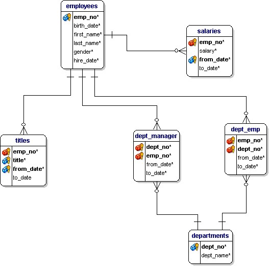
<h2 class="c21" id="h.ugslnw43jjdr">Data Definition</h2>
The DDL file for the database extension can be found at the link below.

<a class="c8" href="https://www.google.com/url?q=https://github.com/Eric-D-Stevens/Employee_DB_Extension_PostgreSQL/blob/master/ddl.sql&amp;sa=D&amp;ust=1595560258278000&amp;usg=AOvVaw1aFTKmsQNUbRWEhln6R5PR">https://github.com/Eric-D-Stevens/Employee_DB_Extension_PostgreSQL/blob/master/ddl.sql</a>

In order to organize the information in a way that the company executives will be able to gether insight from, a schema will be created alongside the current one and attach to it. There will be five tables added to the database:

<ol class="c12 lst-kix_wkmsktt3hvd-0 start" start="1"><li class="c4 c22 c23">Project: The project table will hold the project name, the department responsible for it, and the project manager. The department will be referenced to the department table in the original database and the project manager will reference the employees table in the original database. (NOTE: the assumption is that project managers and department managers are not the same.)</li></ol>
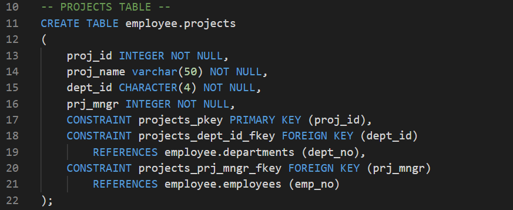

<ol class="c12 lst-kix_wkmsktt3hvd-0" start="2"><li class="c4 c22 c23">Tasks: Projects are made up of tasks, so the project table has a one to many relationship with the tasks table. Each task has a task ID and also maintains the ID of the project it belongs to. Each task will also have a task manager, who may or may not be the project manager.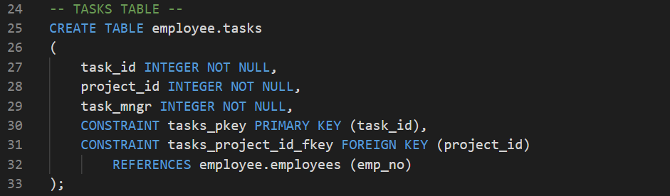</li></ol>

<ol class="c12 lst-kix_wkmsktt3hvd-0" start="3"><li class="c4 c22 c23">Task_Team: This table will keep track of which employees are assigned to which task. Individual employees can be assigned to multiple tasks and there can be many employees assigned to each task, making this table a many to many relationship representation. The table simply has a task ID and an employee id as a compound primary key. Each of the attributes is a foregin key to its respective table.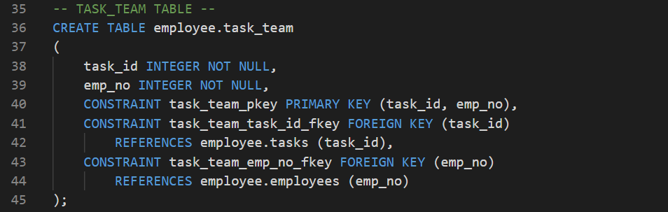</li></ol>

<ol class="c12 lst-kix_wkmsktt3hvd-0" start="4"><li class="c4 c22 c23">Work_Log: The work log table is the one that the company is developing a front end for. It is where employees will summarize what they have been doing over a given period of time. When They enter a summary of what they have been working on, they will be entering it with respect to a task. Therefore, the work log table has both an employee ID, and a task ID as foreign keys. Each log has its own ID, space for a 1000 character summary of the work performed, a start timestamp and an end timestamp.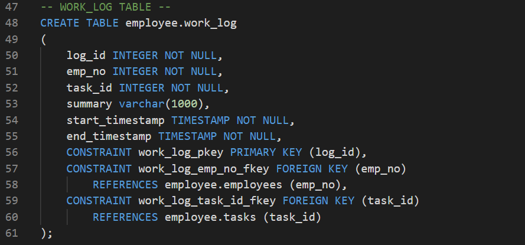</li></ol>

<h2 class="c21" id="h.f2zgzm9mnpk7">Data Engineering</h2>
Once the schema is set up we can assume it is ready to go. Projects can be entered by the department managers and tasks and work logs can be filled out further down the corporate ladder. However, it would be very nice to test our system before we put it in production. This is where things get complicated.

Since work logs and project records have not been kept track of so far, we need to synthesize artificial data. This is not a simple task, since there is a logical organization to the way projects and tasks are partitioned amongst departments. Data cannot just be entered randomly to get a sense of whether the system works. The data will be synthesized sequentially using Python and the Python PSQL library PsycoPG2.

<h3 class="c24" id="h.csriu2z7w0q">PsycoPG2 Helper Class</h3>
A helper class was implemented to maintain database credentials, allow for single call SQL queries, and create utilities for common SQL queries that were used to generate the random data, such as getting a single column from a table. The link to this helper class can be found with the link below.

<a class="c8" href="https://www.google.com/url?q=https://github.com/Eric-D-Stevens/Employee_DB_Extension_PostgreSQL/blob/master/data_engineering/PG.py&amp;sa=D&amp;ust=1595560258281000&amp;usg=AOvVaw1bAPbmyDYjiw9Gfgf9gEnz">https://github.com/Eric-D-Stevens/Employee_DB_Extension_PostgreSQL/blob/master/data_engineering/PG.py</a>

<h3 class="c24" id="h.hwoonjy751tb">Creating the Project Table</h3>
The project table was created by utilizing the names of the missions in the Spy database. Each project is given a name from the spy.mission table and assigned to a random department. Only specific &ldquo;senior&rdquo; job titles are allowed to be project managers, so the employee.title table is parsed through to find employee IDs that have the senior titles. They are randomly assigned as the project managers in the projects table. The code that created the data for this table can be found with the link below.

<a class="c8" href="https://www.google.com/url?q=https://github.com/Eric-D-Stevens/Employee_DB_Extension_PostgreSQL/blob/master/data_engineering/create_project.py&amp;sa=D&amp;ust=1595560258282000&amp;usg=AOvVaw1wE8p-MXZViRMKWhma2TyN">https://github.com/Eric-D-Stevens/Employee_DB_Extension_PostgreSQL/blob/master/data_engineering/create_project.py</a>

<h3 class="c24" id="h.lbu64gs2e7pp">Creating the Tasks Table</h3>
The tasks table holds tasks that are part of a project. A Project can have many tasks and a task may belong to only one project. Tasks also have managers that must come from the same department as the project is assigned to. The code for generating the task table can be found with the link below.

<a class="c8" href="https://www.google.com/url?q=https://github.com/Eric-D-Stevens/Employee_DB_Extension_PostgreSQL/blob/master/data_engineering/create_tasks.py&amp;sa=D&amp;ust=1595560258283000&amp;usg=AOvVaw3OaNhVkhDe_scxxtAf_Gkt">https://github.com/Eric-D-Stevens/Employee_DB_Extension_PostgreSQL/blob/master/data_engineering/create_tasks.py</a>

<h3 class="c24" id="h.422gxk30t08b">Creating the Task Team Table</h3>
The task team table is the relational table between collections of employees and tasks. Employees can be on multiple task teams, as long as all those tasks belong to projects under their assigned department. The code that creates the task team table can be found with the link below.

<a class="c8" href="https://www.google.com/url?q=https://github.com/Eric-D-Stevens/Employee_DB_Extension_PostgreSQL/blob/master/data_engineering/create_task_team.py&amp;sa=D&amp;ust=1595560258283000&amp;usg=AOvVaw0zfrw6vOWY3wUmX8A4hwQV">https://github.com/Eric-D-Stevens/Employee_DB_Extension_PostgreSQL/blob/master/data_engineering/create_task_team.py</a>

<h3 class="c24" id="h.c8chqq0l9z8">Creating the Work Log table</h3>
The work log table represents employees reporting on what they have been doing. Each work log contains an employee id, a task id, a start and end time stamp, and a summary that is generated from random characters. The code used to create the work log table can be found with the link below.

<a class="c8" href="https://www.google.com/url?q=https://github.com/Eric-D-Stevens/Employee_DB_Extension_PostgreSQL/blob/master/data_engineering/create_worklog.py&amp;sa=D&amp;ust=1595560258284000&amp;usg=AOvVaw0emBF-Eb1wS3BkL8PdR9Fa">https://github.com/Eric-D-Stevens/Employee_DB_Extension_PostgreSQL/blob/master/data_engineering/create_worklog.py</a>

<h2 class="c21" id="h.ejjh6c6qi72c">20 Questions</h2>
The first 10 questions are general queries of the original database. The second 10 queries leverage the extension described in this assignment. The SQL file containing these queries can be found with the link below.

<a class="c8" href="https://www.google.com/url?q=https://github.com/Eric-D-Stevens/Employee_DB_Extension_PostgreSQL/blob/master/questions.sql&amp;sa=D&amp;ust=1595560258285000&amp;usg=AOvVaw12k4bujhHqMhpjrnnf2JwG">https://github.com/Eric-D-Stevens/Employee_DB_Extension_PostgreSQL/blob/master/questions.sql</a>

<ol class="c12 lst-kix_asrdtxtrgxa5-0 start" start="1"><li class="c10"><h3 id="h.jdi0p8beys39" style="display:inline">What is the gender breakdown of the company?</h3></li></ol>

<table class="c16"><tbody><tr class="c13"><td class="c5" colspan="1" rowspan="1">
SELECT &nbsp;&nbsp;&nbsp;&nbsp;&nbsp;&nbsp;&nbsp;&nbsp;ROUND( 100 * &nbsp;&nbsp;&nbsp;&nbsp;&nbsp;&nbsp;&nbsp;&nbsp;&nbsp;&nbsp;&nbsp;&nbsp;&nbsp;&nbsp;&nbsp;&nbsp;(SELECT&nbsp;COUNT(*)::NUMERIC  &nbsp;&nbsp;&nbsp;&nbsp;&nbsp;&nbsp;&nbsp;&nbsp;&nbsp;&nbsp;&nbsp;&nbsp;&nbsp;&nbsp;&nbsp;&nbsp;&nbsp;&nbsp;&nbsp;&nbsp;&nbsp;&nbsp;&nbsp;&nbsp;FROM&nbsp;employee.employees e  &nbsp;&nbsp;&nbsp;&nbsp;&nbsp;&nbsp;&nbsp;&nbsp;&nbsp;&nbsp;&nbsp;&nbsp;&nbsp;&nbsp;&nbsp;&nbsp;&nbsp;&nbsp;&nbsp;&nbsp;&nbsp;&nbsp;&nbsp;&nbsp;&nbsp;&nbsp;&nbsp;&nbsp;&nbsp;&nbsp;&nbsp;&nbsp;WHERE&nbsp;e.gender = &#39;F&#39;)/ &nbsp;&nbsp;&nbsp;&nbsp;&nbsp;&nbsp;&nbsp;&nbsp;&nbsp;&nbsp;&nbsp;&nbsp;&nbsp;&nbsp;&nbsp;&nbsp;(SELECT&nbsp;COUNT(*)::NUMERIC  &nbsp;&nbsp;&nbsp;&nbsp;&nbsp;&nbsp;&nbsp;&nbsp;&nbsp;&nbsp;&nbsp;&nbsp;&nbsp;&nbsp;&nbsp;&nbsp;&nbsp;&nbsp;&nbsp;&nbsp;&nbsp;&nbsp;&nbsp;&nbsp;FROM&nbsp;employee.employees) &nbsp;&nbsp;&nbsp;&nbsp;&nbsp;&nbsp;&nbsp;&nbsp;&nbsp;&nbsp;&nbsp;&nbsp;&nbsp;&nbsp;&nbsp;&nbsp;,2 ) as&nbsp;Percent_Female, &nbsp;&nbsp;&nbsp;&nbsp;&nbsp;&nbsp;&nbsp;&nbsp;ROUND( 100 * &nbsp;&nbsp;&nbsp;&nbsp;&nbsp;&nbsp;&nbsp;&nbsp;&nbsp;&nbsp;&nbsp;&nbsp;&nbsp;&nbsp;&nbsp;&nbsp;(SELECT&nbsp;COUNT(*)::NUMERIC  &nbsp;&nbsp;&nbsp;&nbsp;&nbsp;&nbsp;&nbsp;&nbsp;&nbsp;&nbsp;&nbsp;&nbsp;&nbsp;&nbsp;&nbsp;&nbsp;&nbsp;&nbsp;&nbsp;&nbsp;&nbsp;&nbsp;&nbsp;&nbsp;FROM&nbsp;employee.employees e  &nbsp;&nbsp;&nbsp;&nbsp;&nbsp;&nbsp;&nbsp;&nbsp;&nbsp;&nbsp;&nbsp;&nbsp;&nbsp;&nbsp;&nbsp;&nbsp;&nbsp;&nbsp;&nbsp;&nbsp;&nbsp;&nbsp;&nbsp;&nbsp;&nbsp;&nbsp;&nbsp;&nbsp;&nbsp;&nbsp;&nbsp;&nbsp;WHERE&nbsp;e.gender = &#39;M&#39;)/ &nbsp;&nbsp;&nbsp;&nbsp;&nbsp;&nbsp;&nbsp;&nbsp;&nbsp;&nbsp;&nbsp;&nbsp;&nbsp;&nbsp;&nbsp;&nbsp;(SELECT&nbsp;COUNT(*)::NUMERIC FROM&nbsp;employee.employees) &nbsp;&nbsp;&nbsp;&nbsp;&nbsp;&nbsp;&nbsp;&nbsp;&nbsp;&nbsp;&nbsp;&nbsp;&nbsp;&nbsp;&nbsp;&nbsp;,2 ) as&nbsp;Percent_Male

</td></tr></tbody></table>
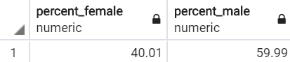

<ol class="c12 lst-kix_asrdtxtrgxa5-0" start="2"><li class="c10"><h3 id="h.a0hlk3r908g2" style="display:inline">Who are the highest and lowest paid employees?</h3></li></ol><table class="c16"><tbody><tr class="c13"><td class="c5" colspan="1" rowspan="1">
SELECT&nbsp;e.emp_no, e.first_name, e.last_name, sm.salary FROM&nbsp;employee.employees e JOIN&nbsp;(  &nbsp;&nbsp;&nbsp;&nbsp;&nbsp;&nbsp;&nbsp;&nbsp;&nbsp;&nbsp;&nbsp;&nbsp;&nbsp;&nbsp;&nbsp;&nbsp;SELECT&nbsp;s.emp_no, s.salary &nbsp;&nbsp;&nbsp;&nbsp;&nbsp;&nbsp;&nbsp;&nbsp;&nbsp;&nbsp;&nbsp;&nbsp;&nbsp;&nbsp;&nbsp;&nbsp;FROM&nbsp;employee.salaries s &nbsp;&nbsp;&nbsp;&nbsp;&nbsp;&nbsp;&nbsp;&nbsp;&nbsp;&nbsp;&nbsp;&nbsp;&nbsp;&nbsp;&nbsp;&nbsp;WHERE&nbsp;s.salary = (SELECT&nbsp;MIN(s.salary)  &nbsp;&nbsp;&nbsp;&nbsp;&nbsp;&nbsp;&nbsp;&nbsp;&nbsp;&nbsp;&nbsp;&nbsp;&nbsp;&nbsp;&nbsp;&nbsp;&nbsp;&nbsp;&nbsp;&nbsp;&nbsp;&nbsp;&nbsp;&nbsp;FROM&nbsp;employee.salaries s) &nbsp;&nbsp;&nbsp;&nbsp;&nbsp;&nbsp;&nbsp;&nbsp;&nbsp;&nbsp;&nbsp;&nbsp;&nbsp;&nbsp;&nbsp;&nbsp;OR&nbsp;s.salary = (SELECT&nbsp;MAX(s.salary)  &nbsp;&nbsp;&nbsp;&nbsp;&nbsp;&nbsp;&nbsp;&nbsp;&nbsp;&nbsp;&nbsp;&nbsp;&nbsp;&nbsp;&nbsp;&nbsp;&nbsp;&nbsp;&nbsp;&nbsp;&nbsp;&nbsp;&nbsp;&nbsp;FROM&nbsp;employee.salaries s) &nbsp;&nbsp;&nbsp;&nbsp;&nbsp;&nbsp;&nbsp;&nbsp; ) sm ON&nbsp;e.emp_no = sm.emp_no
</td></tr></tbody></table>

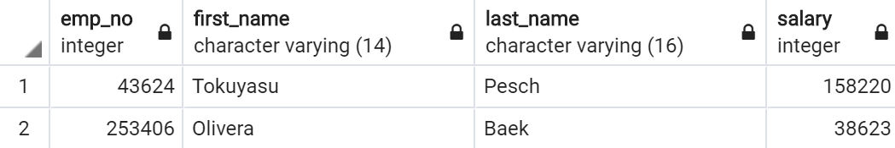

<ol class="c12 lst-kix_asrdtxtrgxa5-0" start="3"><li class="c10"><h3 id="h.ol4n7ha1v29b" style="display:inline">How many people currently work each job title in the company?</h3></li></ol><table class="c16"><tbody><tr class="c13"><td class="c5" colspan="1" rowspan="1">
SELECT&nbsp;t.title, COUNT(*) AS&nbsp;employee_count &nbsp;&nbsp;&nbsp;&nbsp;&nbsp;&nbsp;&nbsp;&nbsp;FROM&nbsp;employee.titles t &nbsp;&nbsp;&nbsp;&nbsp;&nbsp;&nbsp;&nbsp;&nbsp;WHERE&nbsp;t.to_date &gt; current_date &nbsp;&nbsp;&nbsp;&nbsp;&nbsp;&nbsp;&nbsp;&nbsp;GROUP&nbsp;BY&nbsp;t.title
</td></tr></tbody></table>
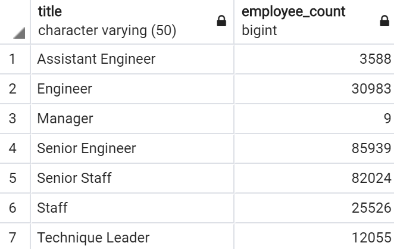

<ol class="c12 lst-kix_asrdtxtrgxa5-0" start="4"><li class="c10"><h3 id="h.pe4mjksxwnd3" style="display:inline">What is the average salary for each job title?</h3></li></ol><table class="c16"><tbody><tr class="c13"><td class="c5" colspan="1" rowspan="1">
SELECT&nbsp;t.title, ROUND(AVG(s.salary),2) as&nbsp;average_salary &nbsp;&nbsp;&nbsp;&nbsp;&nbsp;&nbsp;&nbsp;&nbsp;FROM&nbsp;employee.titles t &nbsp;&nbsp;&nbsp;&nbsp;&nbsp;&nbsp;&nbsp;&nbsp;JOIN&nbsp;employee.salaries s &nbsp;&nbsp;&nbsp;&nbsp;&nbsp;&nbsp;&nbsp;&nbsp;ON&nbsp;t.emp_no = s.emp_no &nbsp;&nbsp;&nbsp;&nbsp;&nbsp;&nbsp;&nbsp;&nbsp;GROUP&nbsp;BY&nbsp;t.title &nbsp;&nbsp;&nbsp;&nbsp;&nbsp;&nbsp;&nbsp;&nbsp;ORDER&nbsp;BY&nbsp;average_salary
</td></tr></tbody></table>
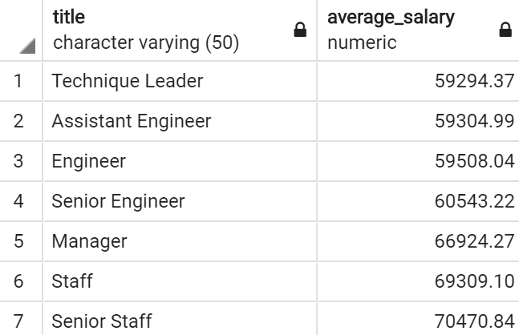

<ol class="c12 lst-kix_asrdtxtrgxa5-0" start="5"><li class="c10"><h3 id="h.lr5z1739jp6g" style="display:inline">How much do department managers make in salary relative to their employees? </h3></li></ol><table class="c16"><tbody><tr class="c13"><td class="c5" colspan="1" rowspan="1">

SELECT&nbsp;d.dept_name,  &nbsp;&nbsp;&nbsp;&nbsp;&nbsp;&nbsp;&nbsp;&nbsp;ROUND(s.salary,2) AS&nbsp;manager_salary,  &nbsp;&nbsp;&nbsp;&nbsp;&nbsp;&nbsp;&nbsp;&nbsp;ROUND(avg_emp_sal.average_employee_salary,2)  &nbsp;&nbsp;&nbsp;&nbsp;&nbsp;&nbsp;&nbsp;&nbsp;&nbsp;&nbsp;&nbsp;&nbsp;&nbsp;&nbsp;&nbsp;&nbsp;AS&nbsp;average_employee_salary FROM&nbsp;employee.departments d JOIN&nbsp;employee.dept_manager dm ON&nbsp;d.dept_no = dm.dept_no JOIN&nbsp;employee.salaries s ON&nbsp;s.emp_no = dm.emp_no JOIN &nbsp;&nbsp;&nbsp;&nbsp;&nbsp;&nbsp;&nbsp;&nbsp;( &nbsp;&nbsp;&nbsp;&nbsp;&nbsp;&nbsp;&nbsp;&nbsp;&nbsp;&nbsp;&nbsp;&nbsp;&nbsp;&nbsp;&nbsp;&nbsp;SELECT&nbsp;adepts.dept_name, AVG(asal.salary)  &nbsp;&nbsp;&nbsp;&nbsp;&nbsp;&nbsp;&nbsp;&nbsp;&nbsp;&nbsp;&nbsp;&nbsp;&nbsp;&nbsp;&nbsp;&nbsp;&nbsp;&nbsp;&nbsp;&nbsp;&nbsp;&nbsp;&nbsp;&nbsp;as&nbsp;average_employee_salary &nbsp;&nbsp;&nbsp;&nbsp;&nbsp;&nbsp;&nbsp;&nbsp;&nbsp;&nbsp;&nbsp;&nbsp;&nbsp;&nbsp;&nbsp;&nbsp;FROM&nbsp;employee.salaries asal &nbsp;&nbsp;&nbsp;&nbsp;&nbsp;&nbsp;&nbsp;&nbsp;&nbsp;&nbsp;&nbsp;&nbsp;&nbsp;&nbsp;&nbsp;&nbsp;JOIN&nbsp;employee.dept_emp aemp &nbsp;&nbsp;&nbsp;&nbsp;&nbsp;&nbsp;&nbsp;&nbsp;&nbsp;&nbsp;&nbsp;&nbsp;&nbsp;&nbsp;&nbsp;&nbsp;ON&nbsp;asal.emp_no = aemp.emp_no &nbsp;&nbsp;&nbsp;&nbsp;&nbsp;&nbsp;&nbsp;&nbsp;&nbsp;&nbsp;&nbsp;&nbsp;&nbsp;&nbsp;&nbsp;&nbsp;JOIN&nbsp;employee.departments adepts &nbsp;&nbsp;&nbsp;&nbsp;&nbsp;&nbsp;&nbsp;&nbsp;&nbsp;&nbsp;&nbsp;&nbsp;&nbsp;&nbsp;&nbsp;&nbsp;ON&nbsp;aemp.dept_no = adepts.dept_no &nbsp;&nbsp;&nbsp;&nbsp;&nbsp;&nbsp;&nbsp;&nbsp;&nbsp;&nbsp;&nbsp;&nbsp;&nbsp;&nbsp;&nbsp;&nbsp;GROUP&nbsp;BY&nbsp;adepts.dept_name &nbsp;&nbsp;&nbsp;&nbsp;&nbsp;&nbsp;&nbsp;&nbsp;) avg_emp_sal ON&nbsp;d.dept_name = avg_emp_sal.dept_name WHERE&nbsp;dm.to_date &gt; current_date AND&nbsp;s.to_date &gt; current_date;

</td></tr></tbody></table>
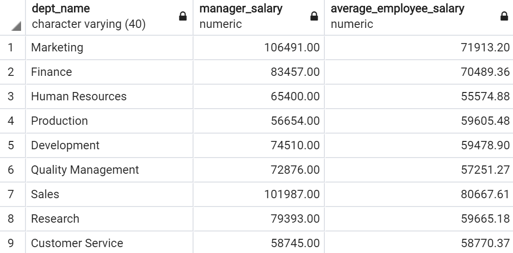

<ol class="c12 lst-kix_asrdtxtrgxa5-0" start="6"><li class="c10"><h3 id="h.1axw8zfjtd9p" style="display:inline">How long did the current manager of the each department work for the company before becoming a manager?</h3></li></ol><table class="c16"><tbody><tr class="c13"><td class="c5" colspan="1" rowspan="1">
SELECT&nbsp;current_managers.dept_name AS&nbsp;department,  joined_company.start_day AS&nbsp;started_at_company,  current_managers.from_date AS&nbsp;started_as_manager, make_interval(years&nbsp;=&gt;  &nbsp;&nbsp;&nbsp;&nbsp;&nbsp;&nbsp;&nbsp;&nbsp;((current_managers.from_date  &nbsp;&nbsp;&nbsp;&nbsp;&nbsp;&nbsp;&nbsp;&nbsp;&nbsp;&nbsp;&nbsp;&nbsp;&nbsp;&nbsp;&nbsp;&nbsp;- joined_company.start_day)/365)) AS&nbsp;years_working_before_manager FROM&nbsp; &nbsp;&nbsp;&nbsp;&nbsp;&nbsp;&nbsp;&nbsp;&nbsp;( &nbsp;&nbsp;&nbsp;&nbsp;&nbsp;&nbsp;&nbsp;&nbsp;&nbsp;&nbsp;&nbsp;&nbsp;&nbsp;&nbsp;&nbsp;&nbsp;SELECT&nbsp; dm.dept_no, depts.dept_name,  &nbsp;&nbsp;&nbsp;&nbsp;&nbsp;&nbsp;&nbsp;&nbsp;&nbsp;&nbsp;&nbsp;&nbsp;&nbsp;&nbsp;&nbsp;&nbsp;&nbsp;&nbsp;&nbsp;&nbsp;&nbsp;&nbsp;&nbsp;&nbsp;dm.emp_no, dm.from_date &nbsp;&nbsp;&nbsp;&nbsp;&nbsp;&nbsp;&nbsp;&nbsp;&nbsp;&nbsp;&nbsp;&nbsp;&nbsp;&nbsp;&nbsp;&nbsp;FROM&nbsp;employee.dept_manager dm &nbsp;&nbsp;&nbsp;&nbsp;&nbsp;&nbsp;&nbsp;&nbsp;&nbsp;&nbsp;&nbsp;&nbsp;&nbsp;&nbsp;&nbsp;&nbsp;JOIN&nbsp;employee.departments depts &nbsp;&nbsp;&nbsp;&nbsp;&nbsp;&nbsp;&nbsp;&nbsp;&nbsp;&nbsp;&nbsp;&nbsp;&nbsp;&nbsp;&nbsp;&nbsp;ON&nbsp;depts.dept_no = dm.dept_no &nbsp;&nbsp;&nbsp;&nbsp;&nbsp;&nbsp;&nbsp;&nbsp;&nbsp;&nbsp;&nbsp;&nbsp;&nbsp;&nbsp;&nbsp;&nbsp;WHERE&nbsp;dm.to_date &gt; current_date &nbsp;&nbsp;&nbsp;&nbsp;&nbsp;&nbsp;&nbsp;&nbsp;) current_managers JOIN &nbsp;&nbsp;&nbsp;&nbsp;&nbsp;&nbsp;&nbsp;&nbsp;( &nbsp;&nbsp;&nbsp;&nbsp;&nbsp;&nbsp;&nbsp;&nbsp;&nbsp;&nbsp;&nbsp;&nbsp;&nbsp;&nbsp;&nbsp;&nbsp;SELECT&nbsp;t.emp_no, MIN(t.from_date) as&nbsp;start_day &nbsp;&nbsp;&nbsp;&nbsp;&nbsp;&nbsp;&nbsp;&nbsp;&nbsp;&nbsp;&nbsp;&nbsp;&nbsp;&nbsp;&nbsp;&nbsp;FROM&nbsp;employee.titles t &nbsp;&nbsp;&nbsp;&nbsp;&nbsp;&nbsp;&nbsp;&nbsp;&nbsp;&nbsp;&nbsp;&nbsp;&nbsp;&nbsp;&nbsp;&nbsp;JOIN&nbsp;employee.dept_manager dm &nbsp;&nbsp;&nbsp;&nbsp;&nbsp;&nbsp;&nbsp;&nbsp;&nbsp;&nbsp;&nbsp;&nbsp;&nbsp;&nbsp;&nbsp;&nbsp;ON&nbsp;t.emp_no = dm.emp_no &nbsp;&nbsp;&nbsp;&nbsp;&nbsp;&nbsp;&nbsp;&nbsp;&nbsp;&nbsp;&nbsp;&nbsp;&nbsp;&nbsp;&nbsp;&nbsp;GROUP&nbsp;BY&nbsp;t.emp_no &nbsp;&nbsp;&nbsp;&nbsp;&nbsp;&nbsp;&nbsp;&nbsp;) joined_company ON&nbsp;current_managers.emp_no = joined_company.emp_no;
</td></tr></tbody></table>

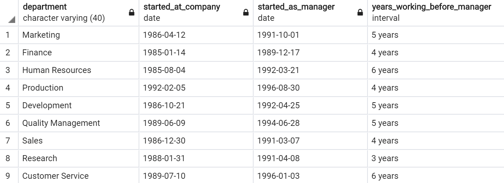
<ol class="c12 lst-kix_asrdtxtrgxa5-0" start="7"><li class="c10"><h3 id="h.k694lj19llxc" style="display:inline">How many employees have held 3 different titles at the company?</h3></li></ol><table class="c16"><tbody><tr class="c13"><td class="c5" colspan="1" rowspan="1">
SELECT&nbsp;title_count.num_titles, COUNT(title_count.emp_no) FROM &nbsp;&nbsp;&nbsp;&nbsp;&nbsp;&nbsp;&nbsp;&nbsp;( &nbsp;&nbsp;&nbsp;&nbsp;&nbsp;&nbsp;&nbsp;&nbsp;&nbsp;&nbsp;&nbsp;&nbsp;&nbsp;&nbsp;&nbsp;&nbsp;SELECT&nbsp;t.emp_no, COUNT(t.title) as&nbsp;num_titles &nbsp;&nbsp;&nbsp;&nbsp;&nbsp;&nbsp;&nbsp;&nbsp;&nbsp;&nbsp;&nbsp;&nbsp;&nbsp;&nbsp;&nbsp;&nbsp;FROM&nbsp;employee.titles t &nbsp;&nbsp;&nbsp;&nbsp;&nbsp;&nbsp;&nbsp;&nbsp;&nbsp;&nbsp;&nbsp;&nbsp;&nbsp;&nbsp;&nbsp;&nbsp;GROUP&nbsp;BY&nbsp;t.emp_no &nbsp;&nbsp;&nbsp;&nbsp;&nbsp;&nbsp;&nbsp;&nbsp;&nbsp;&nbsp;&nbsp;&nbsp;&nbsp;&nbsp;&nbsp;&nbsp;ORDER&nbsp;BY&nbsp;num_titles DESC &nbsp;&nbsp;&nbsp;&nbsp;&nbsp;&nbsp;&nbsp;&nbsp;) title_count WHERE&nbsp;title_count.num_titles = 3 GROUP&nbsp;BY&nbsp;title_count.num_titles;

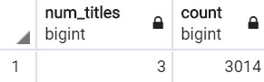
</td></tr></tbody></table>

<ol class="c12 lst-kix_asrdtxtrgxa5-0" start="8"><li class="c10"><h3 id="h.y3fgzhupuxba" style="display:inline">How many employees are named Eric?</h3></li></ol><table class="c16"><tbody><tr class="c13"><td class="c5" colspan="1" rowspan="1">
SELECT&nbsp;COUNT(*) as&nbsp;erics_in_company FROM&nbsp;employee.employees e WHERE&nbsp;e.first_name = &#39;Eric&#39;; &nbsp;&nbsp;&nbsp;&nbsp;&nbsp;&nbsp;&nbsp;&nbsp; 
</td></tr></tbody></table>
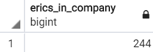

<ol class="c12 lst-kix_asrdtxtrgxa5-0" start="9"><li class="c10"><h3 id="h.ov2z88kkie2f" style="display:inline">How many people currently work in each department?</h3></li></ol><table class="c16"><tbody><tr class="c13"><td class="c5" colspan="1" rowspan="1">
SELECT&nbsp;d.dept_name, COUNT(de.emp_no) as&nbsp;employee_count FROM&nbsp;employee.departments d JOIN&nbsp;employee.dept_emp de ON&nbsp;d.dept_no = de.dept_no WHERE&nbsp;de.to_date &gt; current_date GROUP&nbsp;BY&nbsp;d.dept_name;
</td></tr></tbody></table>
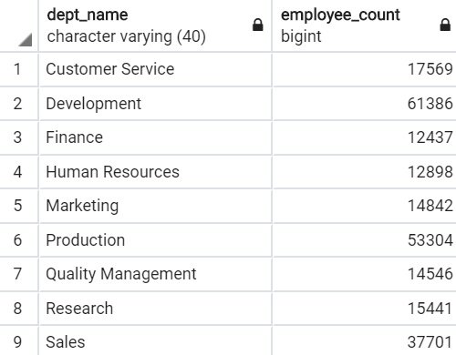

<ol class="c12 lst-kix_asrdtxtrgxa5-0" start="10"><li class="c10"><h3 id="h.st87rna1fd6i" style="display:inline">How much does the company currently pay for all salaries?</h3></li></ol><table class="c16"><tbody><tr class="c13"><td class="c5" colspan="1" rowspan="1">
SELECT&nbsp;SUM(s.salary) AS&nbsp;cost_of_salaries FROM&nbsp;employee.salaries s WHERE&nbsp;s.to_date &gt; current_date;
</td></tr></tbody></table>
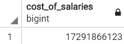

<ol class="c12 lst-kix_asrdtxtrgxa5-0" start="11"><li class="c10"><h3 id="h.3euqj9t5540j" style="display:inline">How many different projects does each department have going?</h3></li></ol><table class="c16"><tbody><tr class="c13"><td class="c5" colspan="1" rowspan="1">
SELECT&nbsp;d.dept_name, COUNT(p.proj_id) as&nbsp;project_count FROM&nbsp;employee.departments d JOIN&nbsp;employee.projects p ON&nbsp;d.dept_no = p.dept_id GROUP&nbsp;BY&nbsp;d.dept_name;
</td></tr></tbody></table>
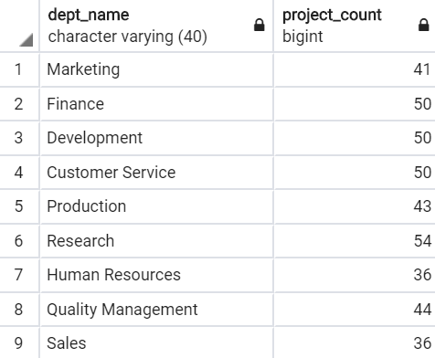

<ol class="c12 lst-kix_asrdtxtrgxa5-0" start="12"><li class="c10"><h3 id="h.5yxqyxtluzj5" style="display:inline">What are the names of the projects under the Human Resources department?</h3></li></ol>

<table class="c16"><tbody><tr class="c13"><td class="c5" colspan="1" rowspan="1">
SELECT&nbsp;d.dept_name, p.proj_name FROM&nbsp;employee.departments d JOIN&nbsp;employee.projects p ON&nbsp;d.dept_no = p.dept_id WHERE&nbsp;d.dept_name = &#39;Human Resources&#39;;
</td></tr></tbody></table>
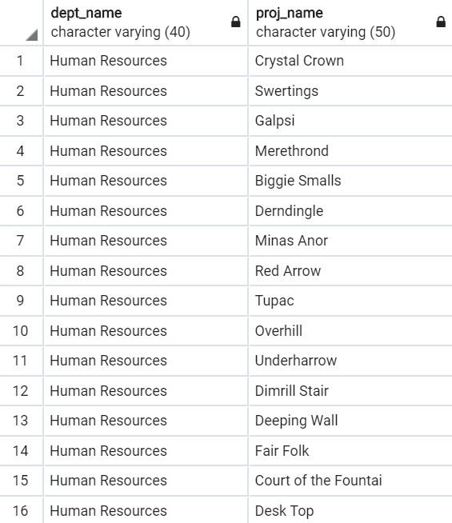&nbsp;(36 Rows)

<ol class="c12 lst-kix_asrdtxtrgxa5-0" start="13"><li class="c10"><h3 id="h.9nsneemge5s6" style="display:inline">Which employees are both department managers and project managers?</h3></li></ol><table class="c16"><tbody><tr class="c13"><td class="c5" colspan="1" rowspan="1">
SELECT&nbsp;dm.emp_no, dm.dept_no, p.proj_id FROM&nbsp;employee.dept_manager dm JOIN&nbsp;employee.projects p ON&nbsp;dm.emp_no = p.prj_mngr;
</td></tr></tbody></table>
( 0 rows)
<ol class="c12 lst-kix_asrdtxtrgxa5-0" start="14"><li class="c10"><h3 id="h.dyc005fo04y" style="display:inline">Which employees are both project managers and task managers?</h3></li></ol><table class="c16"><tbody><tr class="c13"><td class="c5" colspan="1" rowspan="1">
SELECT&nbsp;e.first_name, e.last_name, p.proj_name, t.task_id FROM&nbsp;employee.tasks t JOIN&nbsp;employee.projects p ON&nbsp;t.task_mngr = p.prj_mngr JOIN&nbsp;employee.employees e ON&nbsp;t.task_mngr = e.emp_no WHERE&nbsp;p.proj_id = t.project_id
</td></tr></tbody></table>

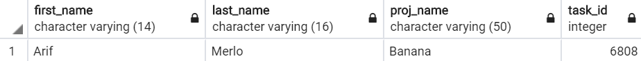

<ol class="c12 lst-kix_asrdtxtrgxa5-0" start="15"><li class="c10"><h3 id="h.4txlwdwyg8yj" style="display:inline">What are the three most common job titles for project managers?</h3></li></ol><table class="c16"><tbody><tr class="c13"><td class="c5" colspan="1" rowspan="1">
SELECT&nbsp;t.title, COUNT(*) AS&nbsp;title_count FROM&nbsp;employee.titles t JOIN&nbsp;employee.projects p ON&nbsp;t.emp_no = p.prj_mngr GROUP&nbsp;BY&nbsp;t.title LIMIT&nbsp;3;
</td></tr></tbody></table>
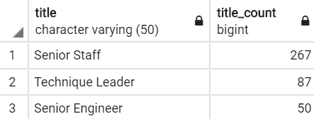

<table class="c16"><tbody><tr class="c13"><td class="c5" colspan="1" rowspan="1">
-- Creation of index for fast lookup of work performed in given range CREATE&nbsp;INDEX&nbsp;work_log_timestamp_range_idx ON&nbsp;employee.work_log(start_timestamp, end_timestamp)
</td></tr></tbody></table>

<ol class="c12 lst-kix_asrdtxtrgxa5-0" start="16"><li class="c10"><h3 id="h.xe2lxsyodgea" style="display:inline">How many work logs have been submitted so far this year?</h3></li></ol><table class="c16"><tbody><tr class="c13"><td class="c5" colspan="1" rowspan="1">
SELECT&nbsp;COUNT(*) AS&nbsp;submitted_work_logs_2020 FROM&nbsp;employee.work_log wl WHERE&nbsp;wl.start_timestamp &gt; &#39;2020-01-10&#39;::DATE;

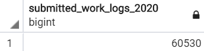

</td></tr></tbody></table>

<ol class="c12 lst-kix_asrdtxtrgxa5-0" start="17"><li class="c10"><h3 id="h.xe7zd9t8e064" style="display:inline">Who are the 10 star employees of 2019 in terms of hours logged (most hours logged in 2019)?</h3></li></ol><table class="c16"><tbody><tr class="c13"></tr></tbody></table>

<table class="c16"><tbody><tr class="c13"><td class="c5" colspan="1" rowspan="1">
SELECT&nbsp;e.emp_no, e.first_name, e.last_name, tlog.time_logged FROM &nbsp;&nbsp;&nbsp;&nbsp;&nbsp;&nbsp;&nbsp;&nbsp;( &nbsp;&nbsp;&nbsp;&nbsp;&nbsp;&nbsp;&nbsp;&nbsp;&nbsp;&nbsp;&nbsp;&nbsp;&nbsp;&nbsp;&nbsp;&nbsp;SELECT&nbsp;wl.emp_no, SUM(wl.end_timestamp-wl.start_timestamp)  &nbsp;&nbsp;&nbsp;&nbsp;&nbsp;&nbsp;&nbsp;&nbsp;&nbsp;&nbsp;&nbsp;&nbsp;&nbsp;&nbsp;&nbsp;&nbsp;&nbsp;&nbsp;&nbsp;&nbsp;&nbsp;&nbsp;&nbsp;&nbsp;as&nbsp;time_logged &nbsp;&nbsp;&nbsp;&nbsp;&nbsp;&nbsp;&nbsp;&nbsp;&nbsp;&nbsp;&nbsp;&nbsp;&nbsp;&nbsp;&nbsp;&nbsp;FROM&nbsp;employee.work_log wl &nbsp;&nbsp;&nbsp;&nbsp;&nbsp;&nbsp;&nbsp;&nbsp;&nbsp;&nbsp;&nbsp;&nbsp;&nbsp;&nbsp;&nbsp;&nbsp;WHERE&nbsp;wl.start_timestamp &gt;= &#39;2019-01-01&#39;::DATE &nbsp;&nbsp;&nbsp;&nbsp;&nbsp;&nbsp;&nbsp;&nbsp;&nbsp;&nbsp;&nbsp;&nbsp;&nbsp;&nbsp;&nbsp;&nbsp;AND&nbsp;wl.end_timestamp &lt; &#39;2020-01-10&#39;::DATE &nbsp;&nbsp;&nbsp;&nbsp;&nbsp;&nbsp;&nbsp;&nbsp;&nbsp;&nbsp;&nbsp;&nbsp;&nbsp;&nbsp;&nbsp;&nbsp;GROUP&nbsp;BY&nbsp;wl.emp_no &nbsp;&nbsp;&nbsp;&nbsp;&nbsp;&nbsp;&nbsp;&nbsp;) tlog JOIN&nbsp;employee.employees e ON&nbsp;tlog.emp_no = e.emp_no ORDER&nbsp;BY&nbsp;tlog.time_logged DESC LIMIT&nbsp;10;
</td></tr></tbody></table>

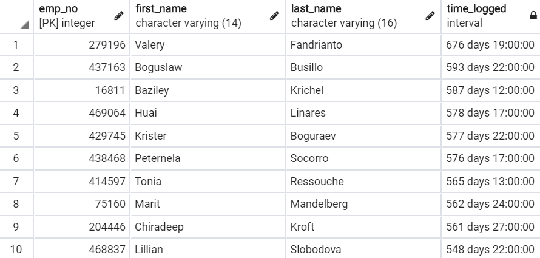

Note: This is obviously where the randomly generated data had some shortcomings, it is not possible for someone to log 2 years worth of hours.This is because in the generation of data employees were not restricted from working on multiple tasks in parallel. Also, the work log allowed entries to span days and even months, so this question does not make 100 percent sense for the design of the data.

<ol class="c12 lst-kix_asrdtxtrgxa5-0" start="18"><li class="c10"><h3 id="h.epuym1yadods" style="display:inline">How much time has been put into each task in the &#39;Dark Years&#39; project?</h3></li></ol>

<table class="c16"><tbody><tr class="c13"><td class="c5" colspan="1" rowspan="1">
SELECT&nbsp;dark_year.proj_name, dark_year.task_id,  sum(wl.end_timestamp - wl.start_timestamp) time_on_task FROM &nbsp;&nbsp;&nbsp;&nbsp;&nbsp;&nbsp;&nbsp;&nbsp;( &nbsp;&nbsp;&nbsp;&nbsp;&nbsp;&nbsp;&nbsp;&nbsp;&nbsp;&nbsp;&nbsp;&nbsp;&nbsp;&nbsp;&nbsp;&nbsp;SELECT&nbsp;p.proj_id, p.proj_name, t.project_id, t.task_id &nbsp;&nbsp;&nbsp;&nbsp;&nbsp;&nbsp;&nbsp;&nbsp;&nbsp;&nbsp;&nbsp;&nbsp;&nbsp;&nbsp;&nbsp;&nbsp;FROM&nbsp;employee.projects p &nbsp;&nbsp;&nbsp;&nbsp;&nbsp;&nbsp;&nbsp;&nbsp;&nbsp;&nbsp;&nbsp;&nbsp;&nbsp;&nbsp;&nbsp;&nbsp;JOIN&nbsp;employee.tasks t &nbsp;&nbsp;&nbsp;&nbsp;&nbsp;&nbsp;&nbsp;&nbsp;&nbsp;&nbsp;&nbsp;&nbsp;&nbsp;&nbsp;&nbsp;&nbsp;ON&nbsp;p.proj_id = t.project_id &nbsp;&nbsp;&nbsp;&nbsp;&nbsp;&nbsp;&nbsp;&nbsp;&nbsp;&nbsp;&nbsp;&nbsp;&nbsp;&nbsp;&nbsp;&nbsp;WHERE&nbsp;p.proj_name = &#39;Dark Years&#39; &nbsp;&nbsp;&nbsp;&nbsp;&nbsp;&nbsp;&nbsp;&nbsp;) dark_year JOIN&nbsp;employee.work_log wl ON&nbsp;dark_year.task_id = wl.task_id GROUP&nbsp;BY&nbsp;(dark_year.proj_name, dark_year.task_id) ORDER&nbsp;BY&nbsp;time_on_task DESC;
</td></tr></tbody></table>
(33 Rows)

<ol class="c12 lst-kix_asrdtxtrgxa5-0" start="19"><li class="c10"><h3 id="h.sai8ra6qbm0n" style="display:inline">Which employees worked on the &#39;Dark Years&#39; project in June of 2018?</h3></li></ol><table class="c16"><tbody><tr class="c13"><td class="c5" colspan="1" rowspan="1">
SELECT&nbsp;e.emp_no, e.first_name, e.last_name FROM&nbsp;employee.employees e JOIN&nbsp;employee.work_log wl ON&nbsp;wl.emp_no = e.emp_no WHERE&nbsp;wl.start_timestamp &gt;= &#39;2018-06-01&#39;::DATE AND&nbsp;wl.end_timestamp &lt; &#39;2018-07-01&#39;::DATE AND&nbsp;wl.task_id IN &nbsp;&nbsp;&nbsp;&nbsp;&nbsp;&nbsp;&nbsp;&nbsp;( &nbsp;&nbsp;&nbsp;&nbsp;&nbsp;&nbsp;&nbsp;&nbsp;&nbsp;&nbsp;&nbsp;&nbsp;&nbsp;&nbsp;&nbsp;&nbsp;SELECT&nbsp;t.task_id &nbsp;&nbsp;&nbsp;&nbsp;&nbsp;&nbsp;&nbsp;&nbsp;&nbsp;&nbsp;&nbsp;&nbsp;&nbsp;&nbsp;&nbsp;&nbsp;FROM&nbsp;employee.tasks t &nbsp;&nbsp;&nbsp;&nbsp;&nbsp;&nbsp;&nbsp;&nbsp;&nbsp;&nbsp;&nbsp;&nbsp;&nbsp;&nbsp;&nbsp;&nbsp;JOIN&nbsp;employee.projects p &nbsp;&nbsp;&nbsp;&nbsp;&nbsp;&nbsp;&nbsp;&nbsp;&nbsp;&nbsp;&nbsp;&nbsp;&nbsp;&nbsp;&nbsp;&nbsp;ON&nbsp;p.proj_id = t.project_id &nbsp;&nbsp;&nbsp;&nbsp;&nbsp;&nbsp;&nbsp;&nbsp;&nbsp;&nbsp;&nbsp;&nbsp;&nbsp;&nbsp;&nbsp;&nbsp;WHERE&nbsp;p.proj_name = &#39;Dark Years&#39; &nbsp;&nbsp;&nbsp;&nbsp;&nbsp;&nbsp;&nbsp;&nbsp;)
</td></tr></tbody></table>

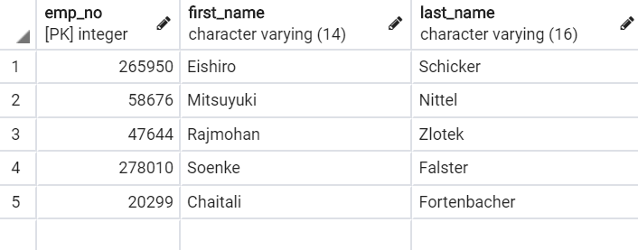

<ol class="c12 lst-kix_asrdtxtrgxa5-0" start="20"><li class="c10"><h3 id="h.3vvkj2loglzd" style="display:inline">A system crash happened on New Years 2020 at around 4:00pm! Which employees logged work on that day in the hours adjacent to the crash?</h3></li></ol><table class="c16"><tbody><tr class="c13"><td class="c5" colspan="1" rowspan="1">
SELECT&nbsp;e.emp_no, e.first_name, e.last_name,  &nbsp;&nbsp;&nbsp;&nbsp;&nbsp;&nbsp;&nbsp;&nbsp;l.end_timestamp AS&nbsp;commited,  &nbsp;&nbsp;&nbsp;&nbsp;&nbsp;&nbsp;&nbsp;&nbsp;l.summary AS&nbsp;summary_of_work FROM&nbsp;employee.employees e JOIN&nbsp;employee.work_log l ON&nbsp;e.emp_no = l.emp_no WHERE&nbsp;l.end_timestamp &gt; &#39;2020-01-01 15:00:00&#39;::TIMESTAMP AND&nbsp;l.end_timestamp &lt; &#39;2020-01-01 17:00:00&#39;::TIMESTAMP;
</td></tr></tbody></table>
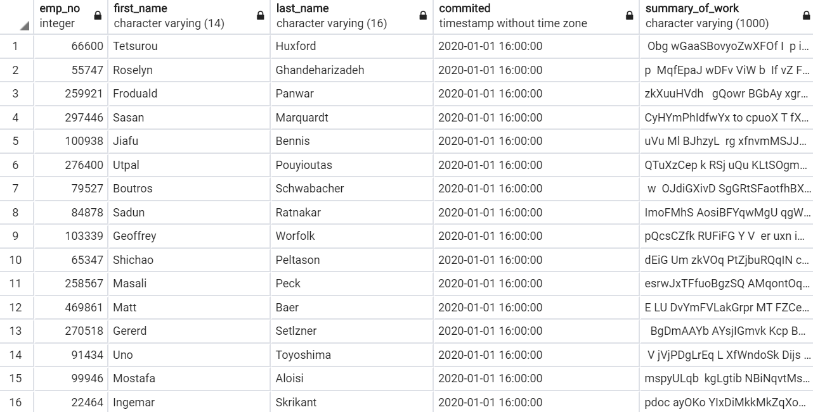
</body></html>