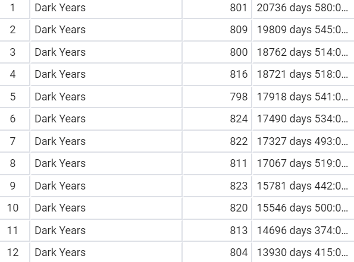

<!-- Copy and paste the converted output. -->

<!-----
NEW: Check the "Suppress top comment" option to remove this info from the output.

Conversion time: 7.823 seconds.


Using this Markdown file:

1. Paste this output into your source file.
2. See the notes and action items below regarding this conversion run.
3. Check the rendered output (headings, lists, code blocks, tables) for proper
   formatting and use a linkchecker before you publish this page.

Conversion notes:

* Docs to Markdown version 1.0β29
* Thu Jul 23 2020 19:18:26 GMT-0700 (PDT)
* Source doc: Databases Final Project Milestone 4

ERROR:
undefined internal link to this URL: "#heading=h.yucnyeu1hzl0".link text: Background
?Did you generate a TOC?


ERROR:
undefined internal link to this URL: "#heading=h.x7jeun3yaish".link text: The Story
?Did you generate a TOC?


ERROR:
undefined internal link to this URL: "#heading=h.ugslnw43jjdr".link text: Data Definition
?Did you generate a TOC?


ERROR:
undefined internal link to this URL: "#heading=h.f2zgzm9mnpk7".link text: Data Engineering
?Did you generate a TOC?


ERROR:
undefined internal link to this URL: "#heading=h.ejjh6c6qi72c".link text: 20 Questions
?Did you generate a TOC?

* Tables are currently converted to HTML tables.
* This document has images: check for >>>>>  gd2md-html alert:  inline image link in generated source and store images to your server. NOTE: Images in exported zip file from Google Docs may not appear in  the same order as they do in your doc. Please check the images!

----->


<p style="color: red; font-weight: bold">>>>>>  gd2md-html alert:  ERRORs: 5; WARNINGs: 0; ALERTS: 28.</p>
<ul style="color: red; font-weight: bold"><li>See top comment block for details on ERRORs and WARNINGs. <li>In the converted Markdown or HTML, search for inline alerts that start with >>>>>  gd2md-html alert:  for specific instances that need correction.</ul>

<p style="color: red; font-weight: bold">Links to alert messages:</p><a href="#gdcalert1">alert1</a>
<a href="#gdcalert2">alert2</a>
<a href="#gdcalert3">alert3</a>
<a href="#gdcalert4">alert4</a>
<a href="#gdcalert5">alert5</a>
<a href="#gdcalert6">alert6</a>
<a href="#gdcalert7">alert7</a>
<a href="#gdcalert8">alert8</a>
<a href="#gdcalert9">alert9</a>
<a href="#gdcalert10">alert10</a>
<a href="#gdcalert11">alert11</a>
<a href="#gdcalert12">alert12</a>
<a href="#gdcalert13">alert13</a>
<a href="#gdcalert14">alert14</a>
<a href="#gdcalert15">alert15</a>
<a href="#gdcalert16">alert16</a>
<a href="#gdcalert17">alert17</a>
<a href="#gdcalert18">alert18</a>
<a href="#gdcalert19">alert19</a>
<a href="#gdcalert20">alert20</a>
<a href="#gdcalert21">alert21</a>
<a href="#gdcalert22">alert22</a>
<a href="#gdcalert23">alert23</a>
<a href="#gdcalert24">alert24</a>
<a href="#gdcalert25">alert25</a>
<a href="#gdcalert26">alert26</a>
<a href="#gdcalert27">alert27</a>
<a href="#gdcalert28">alert28</a>

<p style="color: red; font-weight: bold">>>>>> PLEASE check and correct alert issues and delete this message and the inline alerts.<hr></p>


<h2>Postgres & Python</h2>


<p>Eric D. Stevens

<p>Git Repo: [https://github.com/Eric-D-Stevens/Employee_DB_Extension_PostgreSQL](https://github.com/Eric-D-Stevens/Employee_DB_Extension_PostgreSQL)

<h3>Outline</h3>


<p id="gdcalert1" ><span style="color: red; font-weight: bold">>>>>>  gd2md-html alert: undefined internal link (link text: "Background"). Did you generate a TOC? </span><br>(<a href="#">Back to top</a>)(<a href="#gdcalert2">Next alert</a>)<br><span style="color: red; font-weight: bold">>>>>> </span></p>

[Background](#heading=h.yucnyeu1hzl0): General information regarding the project 


<p id="gdcalert2" ><span style="color: red; font-weight: bold">>>>>>  gd2md-html alert: undefined internal link (link text: "The Story"). Did you generate a TOC? </span><br>(<a href="#">Back to top</a>)(<a href="#gdcalert3">Next alert</a>)<br><span style="color: red; font-weight: bold">>>>>> </span></p>

[The Story](#heading=h.x7jeun3yaish): A playful story that allowed me to conceptualize the project


<p id="gdcalert3" ><span style="color: red; font-weight: bold">>>>>>  gd2md-html alert: undefined internal link (link text: "Data Definition"). Did you generate a TOC? </span><br>(<a href="#">Back to top</a>)(<a href="#gdcalert4">Next alert</a>)<br><span style="color: red; font-weight: bold">>>>>> </span></p>

[Data Definition](#heading=h.ugslnw43jjdr): The extension to the database schema


<p id="gdcalert4" ><span style="color: red; font-weight: bold">>>>>>  gd2md-html alert: undefined internal link (link text: "Data Engineering"). Did you generate a TOC? </span><br>(<a href="#">Back to top</a>)(<a href="#gdcalert5">Next alert</a>)<br><span style="color: red; font-weight: bold">>>>>> </span></p>

[Data Engineering](#heading=h.f2zgzm9mnpk7): Python generation of dummy data to allow for testing


<p id="gdcalert5" ><span style="color: red; font-weight: bold">>>>>>  gd2md-html alert: undefined internal link (link text: "20 Questions"). Did you generate a TOC? </span><br>(<a href="#">Back to top</a>)(<a href="#gdcalert6">Next alert</a>)<br><span style="color: red; font-weight: bold">>>>>> </span></p>

[20 Questions](#heading=h.ejjh6c6qi72c): 10 queries on the large original database, 10 leveraging the extension

<h3>Background</h3>


This project starts out with a large pre-built database that I imported to the PSU server. I felt that integrating with a pre-existing database would be a very good exercise. I will not be including the full database in my git repo because it is several hundred megabytes and easily accessible elsewhere: The PostgreSQL implementation can be found here: [https://github.com/vrajmohan/pgsql-sample-data/tree/master/employee](https://github.com/vrajmohan/pgsql-sample-data/tree/master/employee). This repository is a port to Postgres from the original MySql implementation which can be found here: [https://github.com/datacharmer/test_db](https://github.com/datacharmer/test_db).

This project is focused on extending the existing schema with rational components that could hypothetically extend the functionality of the database. Much of the time spent on this project was focused on the effort to synthesize data that would result in logical relationships in the schema. The amount of time and effort that went into engineering the synthetic data may have taken away from implementing a more sophisticated database, the overall product of the work performs well and accomplishes what it intends to.

<h3>The story</h3>


I am working for a large software company that has a huge database of its employees, which departments they work for, what their salaries are and who the managers of each department are. The company, however, is not keeping track of the state of it’s projects and the output of individual employees. As a result, the company believes it is operating inefficiently and is losing money.  

The executives have contracted me to build out their database to provide more insight into the performance at the project management level, as well as at individual contributor level. To do this they have agreed to build out a front end system that will allow employees to summarize what they have been working on in a given time period. They want me to build out a back end to store the employee self reporting records, as well as a number of other organizational relations that will help them locate inefficiencies in their company. The database schema that they currently have can be seen below.


<p id="gdcalert6" ><span style="color: red; font-weight: bold">>>>>>  gd2md-html alert: inline image link here (to images/image1.png). Store image on your image server and adjust path/filename/extension if necessary. </span><br>(<a href="#">Back to top</a>)(<a href="#gdcalert7">Next alert</a>)<br><span style="color: red; font-weight: bold">>>>>> </span></p>


<h3>Data Definition</h3>


The DDL file for the database extension can be found at the link below.

[https://github.com/Eric-D-Stevens/Employee_DB_Extension_PostgreSQL/blob/master/ddl.sql](https://github.com/Eric-D-Stevens/Employee_DB_Extension_PostgreSQL/blob/master/ddl.sql)

In order to organize the information in a way that the company executives will be able to gether insight from, a schema will be created alongside the current one and attach to it. There will be five tables added to the database:


1. Project: The project table will hold the project name, the department responsible for it, and the project manager. The department will be referenced to the department table in the original database and the project manager will reference the employees table in the original database. (NOTE: the assumption is that project managers and department managers are not the same.)

    

<p id="gdcalert7" ><span style="color: red; font-weight: bold">>>>>>  gd2md-html alert: inline image link here (to images/image2.png). Store image on your image server and adjust path/filename/extension if necessary. </span><br>(<a href="#">Back to top</a>)(<a href="#gdcalert8">Next alert</a>)<br><span style="color: red; font-weight: bold">>>>>> </span></p>


2. Tasks: Projects are made up of tasks, so the project table has a one to many relationship with the tasks table. Each task has a task ID and also maintains the ID of the project it belongs to. Each task will also have a task manager, who may or may not be the project manager.

<p id="gdcalert8" ><span style="color: red; font-weight: bold">>>>>>  gd2md-html alert: inline image link here (to images/image3.png). Store image on your image server and adjust path/filename/extension if necessary. </span><br>(<a href="#">Back to top</a>)(<a href="#gdcalert9">Next alert</a>)<br><span style="color: red; font-weight: bold">>>>>> </span></p>


3. Task_Team: This table will keep track of which employees are assigned to which task. Individual employees can be assigned to multiple tasks and there can be many employees assigned to each task, making this table a many to many relationship representation. The table simply has a task ID and an employee id as a compound primary key. Each of the attributes is a foregin key to its respective table.

<p id="gdcalert9" ><span style="color: red; font-weight: bold">>>>>>  gd2md-html alert: inline image link here (to images/image4.png). Store image on your image server and adjust path/filename/extension if necessary. </span><br>(<a href="#">Back to top</a>)(<a href="#gdcalert10">Next alert</a>)<br><span style="color: red; font-weight: bold">>>>>> </span></p>


4. Work_Log: The work log table is the one that the company is developing a front end for. It is where employees will summarize what they have been doing over a given period of time. When They enter a summary of what they have been working on, they will be entering it with respect to a task. Therefore, the work log table has both an employee ID, and a task ID as foreign keys. Each log has its own ID, space for a 1000 character summary of the work performed, a start timestamp and an end timestamp.

<p id="gdcalert10" ><span style="color: red; font-weight: bold">>>>>>  gd2md-html alert: inline image link here (to images/image5.png). Store image on your image server and adjust path/filename/extension if necessary. </span><br>(<a href="#">Back to top</a>)(<a href="#gdcalert11">Next alert</a>)<br><span style="color: red; font-weight: bold">>>>>> </span></p>


<h3>Data Engineering</h3>


Once the schema is set up we can assume it is ready to go. Projects can be entered by the department managers and tasks and work logs can be filled out further down the corporate ladder. However, it would be very nice to test our system before we put it in production. This is where things get complicated.

Since work logs and project records have not been kept track of so far, we need to synthesize artificial data. This is not a simple task, since there is a logical organization to the way projects and tasks are partitioned amongst departments. Data cannot just be entered randomly to get a sense of whether the system works. The data will be synthesized sequentially using Python and the Python PSQL library PsycoPG2.

<h4>PsycoPG2 Helper Class</h4>


A helper class was implemented to maintain database credentials, allow for single call SQL queries, and create utilities for common SQL queries that were used to generate the random data, such as getting a single column from a table. The link to this helper class can be found with the link below.

[https://github.com/Eric-D-Stevens/Employee_DB_Extension_PostgreSQL/blob/master/data_engineering/PG.py](https://github.com/Eric-D-Stevens/Employee_DB_Extension_PostgreSQL/blob/master/data_engineering/PG.py)

<h4>Creating the Project Table</h4>


The project table was created by utilizing the names of the missions in the Spy database. Each project is given a name from the spy.mission table and assigned to a random department. Only specific “senior” job titles are allowed to be project managers, so the employee.title table is parsed through to find employee IDs that have the senior titles. They are randomly assigned as the project managers in the projects table. The code that created the data for this table can be found with the link below.

[https://github.com/Eric-D-Stevens/Employee_DB_Extension_PostgreSQL/blob/master/data_engineering/create_project.py](https://github.com/Eric-D-Stevens/Employee_DB_Extension_PostgreSQL/blob/master/data_engineering/create_project.py)

<h4>Creating the Tasks Table</h4>


The tasks table holds tasks that are part of a project. A Project can have many tasks and a task may belong to only one project. Tasks also have managers that must come from the same department as the project is assigned to. The code for generating the task table can be found with the link below.

[https://github.com/Eric-D-Stevens/Employee_DB_Extension_PostgreSQL/blob/master/data_engineering/create_tasks.py](https://github.com/Eric-D-Stevens/Employee_DB_Extension_PostgreSQL/blob/master/data_engineering/create_tasks.py)

<h4>Creating the Task Team Table</h4>


The task team table is the relational table between collections of employees and tasks. Employees can be on multiple task teams, as long as all those tasks belong to projects under their assigned department. The code that creates the task team table can be found with the link below.

[https://github.com/Eric-D-Stevens/Employee_DB_Extension_PostgreSQL/blob/master/data_engineering/create_task_team.py](https://github.com/Eric-D-Stevens/Employee_DB_Extension_PostgreSQL/blob/master/data_engineering/create_task_team.py)

<h4>Creating the Work Log table</h4>


The work log table represents employees reporting on what they have been doing. Each work log contains an employee id, a task id, a start and end time stamp, and a summary that is generated from random characters. The code used to create the work log table can be found with the link below.

[https://github.com/Eric-D-Stevens/Employee_DB_Extension_PostgreSQL/blob/master/data_engineering/create_worklog.py](https://github.com/Eric-D-Stevens/Employee_DB_Extension_PostgreSQL/blob/master/data_engineering/create_worklog.py)

<h3>20 Questions</h3>


The first 10 questions are general queries of the original database. The second 10 queries leverage the extension described in this assignment. The SQL file containing these queries can be found with the link below.

[https://github.com/Eric-D-Stevens/Employee_DB_Extension_PostgreSQL/blob/master/questions.sql](https://github.com/Eric-D-Stevens/Employee_DB_Extension_PostgreSQL/blob/master/questions.sql)


1. What is the gender breakdown of the company?

    ```
SELECT
	ROUND( 100 *
		(SELECT COUNT(*)::NUMERIC 
			FROM employee.employees e 
				WHERE e.gender = 'F')/
		(SELECT COUNT(*)::NUMERIC 
			FROM employee.employees)
		,2 ) as Percent_Female,
	ROUND( 100 *
		(SELECT COUNT(*)::NUMERIC 
			FROM employee.employees e 
				WHERE e.gender = 'M')/
		(SELECT COUNT(*)::NUMERIC FROM employee.employees)
		,2 ) as Percent_Male

```


<p id="gdcalert11" ><span style="color: red; font-weight: bold">>>>>>  gd2md-html alert: inline image link here (to images/image6.png). Store image on your image server and adjust path/filename/extension if necessary. </span><br>(<a href="#">Back to top</a>)(<a href="#gdcalert12">Next alert</a>)<br><span style="color: red; font-weight: bold">>>>>> </span></p>


2. Who are the highest and lowest paid employees?

    ```
SELECT e.emp_no, e.first_name, e.last_name, sm.salary
FROM employee.employees e
JOIN ( 
		SELECT s.emp_no, s.salary
		FROM employee.salaries s
		WHERE s.salary = (SELECT MIN(s.salary) 
			FROM employee.salaries s)
		OR s.salary = (SELECT MAX(s.salary) 
			FROM employee.salaries s)
	 ) sm
ON e.emp_no = sm.emp_no
```


<p id="gdcalert12" ><span style="color: red; font-weight: bold">>>>>>  gd2md-html alert: inline image link here (to images/image7.png). Store image on your image server and adjust path/filename/extension if necessary. </span><br>(<a href="#">Back to top</a>)(<a href="#gdcalert13">Next alert</a>)<br><span style="color: red; font-weight: bold">>>>>> </span></p>


3. How many people currently work each job title in the company?

    ```
SELECT t.title, COUNT(*) AS employee_count
	FROM employee.titles t
	WHERE t.to_date > current_date
	GROUP BY t.title
```


<p id="gdcalert13" ><span style="color: red; font-weight: bold">>>>>>  gd2md-html alert: inline image link here (to images/image8.png). Store image on your image server and adjust path/filename/extension if necessary. </span><br>(<a href="#">Back to top</a>)(<a href="#gdcalert14">Next alert</a>)<br><span style="color: red; font-weight: bold">>>>>> </span></p>





4. What is the average salary for each job title?

    ```
SELECT t.title, ROUND(AVG(s.salary),2) as average_salary
	FROM employee.titles t
	JOIN employee.salaries s
	ON t.emp_no = s.emp_no
	GROUP BY t.title
	ORDER BY average_salary
```


<p id="gdcalert14" ><span style="color: red; font-weight: bold">>>>>>  gd2md-html alert: inline image link here (to images/image9.png). Store image on your image server and adjust path/filename/extension if necessary. </span><br>(<a href="#">Back to top</a>)(<a href="#gdcalert15">Next alert</a>)<br><span style="color: red; font-weight: bold">>>>>> </span></p>


5. How much do department managers make in salary relative to their employees? 

    ```

SELECT d.dept_name, 
	ROUND(s.salary,2) AS manager_salary, 
	ROUND(avg_emp_sal.average_employee_salary,2) 
		AS average_employee_salary
FROM employee.departments d
JOIN employee.dept_manager dm
ON d.dept_no = dm.dept_no
JOIN employee.salaries s
ON s.emp_no = dm.emp_no
JOIN
	(
		SELECT adepts.dept_name, AVG(asal.salary) 
			as average_employee_salary
		FROM employee.salaries asal
		JOIN employee.dept_emp aemp
		ON asal.emp_no = aemp.emp_no
		JOIN employee.departments adepts
		ON aemp.dept_no = adepts.dept_no
		GROUP BY adepts.dept_name
	) avg_emp_sal
ON d.dept_name = avg_emp_sal.dept_name
WHERE dm.to_date > current_date
AND s.to_date > current_date;

```


<p id="gdcalert15" ><span style="color: red; font-weight: bold">>>>>>  gd2md-html alert: inline image link here (to images/image10.png). Store image on your image server and adjust path/filename/extension if necessary. </span><br>(<a href="#">Back to top</a>)(<a href="#gdcalert16">Next alert</a>)<br><span style="color: red; font-weight: bold">>>>>> </span></p>


6. How long did the current manager of the each department work for the company before becoming a manager?

    ```
SELECT current_managers.dept_name AS department, 
joined_company.start_day AS started_at_company, 
current_managers.from_date AS started_as_manager,
make_interval(years => 
	((current_managers.from_date 
		- joined_company.start_day)/365))
AS years_working_before_manager
FROM 
	(
		SELECT  dm.dept_no, depts.dept_name, 
			dm.emp_no, dm.from_date
		FROM employee.dept_manager dm
		JOIN employee.departments depts
		ON depts.dept_no = dm.dept_no
		WHERE dm.to_date > current_date
	) current_managers
JOIN
	(
		SELECT t.emp_no, MIN(t.from_date) as start_day
		FROM employee.titles t
		JOIN employee.dept_manager dm
		ON t.emp_no = dm.emp_no
		GROUP BY t.emp_no
	) joined_company
ON current_managers.emp_no = joined_company.emp_no;
```


<p id="gdcalert16" ><span style="color: red; font-weight: bold">>>>>>  gd2md-html alert: inline image link here (to images/image11.png). Store image on your image server and adjust path/filename/extension if necessary. </span><br>(<a href="#">Back to top</a>)(<a href="#gdcalert17">Next alert</a>)<br><span style="color: red; font-weight: bold">>>>>> </span></p>


7. How many employees have held 3 different titles at the company?

    ```
SELECT title_count.num_titles, COUNT(title_count.emp_no)
FROM
	(
		SELECT t.emp_no, COUNT(t.title) as num_titles
		FROM employee.titles t
		GROUP BY t.emp_no
		ORDER BY num_titles DESC
	) title_count
WHERE title_count.num_titles = 3
GROUP BY title_count.num_titles;


```


8. How many employees are named Eric?

    ```
SELECT COUNT(*) as erics_in_company
FROM employee.employees e
WHERE e.first_name = 'Eric';
	 
```


<p id="gdcalert17" ><span style="color: red; font-weight: bold">>>>>>  gd2md-html alert: inline image link here (to images/image12.png). Store image on your image server and adjust path/filename/extension if necessary. </span><br>(<a href="#">Back to top</a>)(<a href="#gdcalert18">Next alert</a>)<br><span style="color: red; font-weight: bold">>>>>> </span></p>


9. How many people currently work in each department?

    ```
SELECT d.dept_name, COUNT(de.emp_no) as employee_count
FROM employee.departments d
JOIN employee.dept_emp de
ON d.dept_no = de.dept_no
WHERE de.to_date > current_date
GROUP BY d.dept_name;
```


<p id="gdcalert18" ><span style="color: red; font-weight: bold">>>>>>  gd2md-html alert: inline image link here (to images/image13.png). Store image on your image server and adjust path/filename/extension if necessary. </span><br>(<a href="#">Back to top</a>)(<a href="#gdcalert19">Next alert</a>)<br><span style="color: red; font-weight: bold">>>>>> </span></p>


10. How much does the company currently pay for all salaries?

    ```
SELECT SUM(s.salary) AS cost_of_salaries
FROM employee.salaries s
WHERE s.to_date > current_date;
```


<p id="gdcalert19" ><span style="color: red; font-weight: bold">>>>>>  gd2md-html alert: inline image link here (to images/image14.png). Store image on your image server and adjust path/filename/extension if necessary. </span><br>(<a href="#">Back to top</a>)(<a href="#gdcalert20">Next alert</a>)<br><span style="color: red; font-weight: bold">>>>>> </span></p>


11. How many different projects does each department have going?

    ```
SELECT d.dept_name, COUNT(p.proj_id) as project_count
FROM employee.departments d
JOIN employee.projects p
ON d.dept_no = p.dept_id
GROUP BY d.dept_name;
```


<p id="gdcalert20" ><span style="color: red; font-weight: bold">>>>>>  gd2md-html alert: inline image link here (to images/image15.png). Store image on your image server and adjust path/filename/extension if necessary. </span><br>(<a href="#">Back to top</a>)(<a href="#gdcalert21">Next alert</a>)<br><span style="color: red; font-weight: bold">>>>>> </span></p>


12. What are the names of the projects under the Human Resources department?

    ```
SELECT d.dept_name, p.proj_name
FROM employee.departments d
JOIN employee.projects p
ON d.dept_no = p.dept_id
WHERE d.dept_name = 'Human Resources';
```


<p id="gdcalert21" ><span style="color: red; font-weight: bold">>>>>>  gd2md-html alert: inline image link here (to images/image16.png). Store image on your image server and adjust path/filename/extension if necessary. </span><br>(<a href="#">Back to top</a>)(<a href="#gdcalert22">Next alert</a>)<br><span style="color: red; font-weight: bold">>>>>> </span></p>


 (36 Rows)


13. Which employees are both department managers and project managers?

    ```
SELECT dm.emp_no, dm.dept_no, p.proj_id
FROM employee.dept_manager dm
JOIN employee.projects p
ON dm.emp_no = p.prj_mngr;
```


<p id="gdcalert22" ><span style="color: red; font-weight: bold">>>>>>  gd2md-html alert: inline image link here (to images/image17.png). Store image on your image server and adjust path/filename/extension if necessary. </span><br>(<a href="#">Back to top</a>)(<a href="#gdcalert23">Next alert</a>)<br><span style="color: red; font-weight: bold">>>>>> </span></p>


( 0 rows)


14. Which employees are both project managers and task managers?

    ```
SELECT e.first_name, e.last_name, p.proj_name, t.task_id
FROM employee.tasks t
JOIN employee.projects p
ON t.task_mngr = p.prj_mngr
JOIN employee.employees e
ON t.task_mngr = e.emp_no
WHERE p.proj_id = t.project_id
```


<p id="gdcalert23" ><span style="color: red; font-weight: bold">>>>>>  gd2md-html alert: inline image link here (to images/image18.png). Store image on your image server and adjust path/filename/extension if necessary. </span><br>(<a href="#">Back to top</a>)(<a href="#gdcalert24">Next alert</a>)<br><span style="color: red; font-weight: bold">>>>>> </span></p>


15. What are the three most common job titles for project managers?

    ```
SELECT t.title, COUNT(*) AS title_count
FROM employee.titles t
JOIN employee.projects p
ON t.emp_no = p.prj_mngr
GROUP BY t.title
LIMIT 3;
```


<p id="gdcalert24" ><span style="color: red; font-weight: bold">>>>>>  gd2md-html alert: inline image link here (to images/image19.png). Store image on your image server and adjust path/filename/extension if necessary. </span><br>(<a href="#">Back to top</a>)(<a href="#gdcalert25">Next alert</a>)<br><span style="color: red; font-weight: bold">>>>>> </span></p>


```
-- Creation of index for fast lookup of work performed in given range
CREATE INDEX work_log_timestamp_range_idx ON employee.work_log(start_timestamp, end_timestamp)
```


16. How many work logs have been submitted so far this year?

    ```
SELECT COUNT(*) AS submitted_work_logs_2020
FROM employee.work_log wl
WHERE wl.start_timestamp > '2020-01-10'::DATE;


```


17. Who are the 10 star employees of 2019 in terms of hours logged (most hours logged in 2019)?

<table>
  <tr>
  </tr>
</table>


    ```
SELECT e.emp_no, e.first_name, e.last_name, tlog.time_logged
FROM
	(
		SELECT wl.emp_no, SUM(wl.end_timestamp-wl.start_timestamp) 
			as time_logged
		FROM employee.work_log wl
		WHERE wl.start_timestamp >= '2019-01-01'::DATE
		AND wl.end_timestamp < '2020-01-10'::DATE
		GROUP BY wl.emp_no
	) tlog
JOIN employee.employees e
ON tlog.emp_no = e.emp_no
ORDER BY tlog.time_logged DESC
LIMIT 10;
```


<p id="gdcalert25" ><span style="color: red; font-weight: bold">>>>>>  gd2md-html alert: inline image link here (to images/image20.png). Store image on your image server and adjust path/filename/extension if necessary. </span><br>(<a href="#">Back to top</a>)(<a href="#gdcalert26">Next alert</a>)<br><span style="color: red; font-weight: bold">>>>>> </span></p>


Note: This is obviously where the randomly generated data had some shortcomings, it is not possible for someone to log 2 years worth of hours.This is because in the generation of data employees were not restricted from working on multiple tasks in parallel. Also, the work log allowed entries to span days and even months, so this question does not make 100 percent sense for the design of the data.


18. How much time has been put into each task in the 'Dark Years' project?

    ```
SELECT dark_year.proj_name, dark_year.task_id, 
sum(wl.end_timestamp - wl.start_timestamp) time_on_task
FROM
	(
		SELECT p.proj_id, p.proj_name, t.project_id, t.task_id
		FROM employee.projects p
		JOIN employee.tasks t
		ON p.proj_id = t.project_id
		WHERE p.proj_name = 'Dark Years'
	) dark_year
JOIN employee.work_log wl
ON dark_year.task_id = wl.task_id
GROUP BY (dark_year.proj_name, dark_year.task_id)
ORDER BY time_on_task DESC;
```


<p id="gdcalert26" ><span style="color: red; font-weight: bold">>>>>>  gd2md-html alert: inline image link here (to images/image21.png). Store image on your image server and adjust path/filename/extension if necessary. </span><br>(<a href="#">Back to top</a>)(<a href="#gdcalert27">Next alert</a>)<br><span style="color: red; font-weight: bold">>>>>> </span></p>


(33 Rows)


19. Which employees worked on the 'Dark Years' project in June of 2018?

    ```
SELECT e.emp_no, e.first_name, e.last_name
FROM employee.employees e
JOIN employee.work_log wl
ON wl.emp_no = e.emp_no
WHERE wl.start_timestamp >= '2018-06-01'::DATE
AND wl.end_timestamp < '2018-07-01'::DATE
AND wl.task_id IN
	(
		SELECT t.task_id
		FROM employee.tasks t
		JOIN employee.projects p
		ON p.proj_id = t.project_id
		WHERE p.proj_name = 'Dark Years'
	)
```


<p id="gdcalert27" ><span style="color: red; font-weight: bold">>>>>>  gd2md-html alert: inline image link here (to images/image22.png). Store image on your image server and adjust path/filename/extension if necessary. </span><br>(<a href="#">Back to top</a>)(<a href="#gdcalert28">Next alert</a>)<br><span style="color: red; font-weight: bold">>>>>> </span></p>


20. A system crash happened on New Years 2020 at around 4:00pm! Which employees logged work on that day in the hours adjacent to the crash?

    ```
SELECT e.emp_no, e.first_name, e.last_name, 
	l.end_timestamp AS commited, 
	l.summary AS summary_of_work
FROM employee.employees e
JOIN employee.work_log l
ON e.emp_no = l.emp_no
WHERE l.end_timestamp > '2020-01-01 15:00:00'::TIMESTAMP
AND l.end_timestamp < '2020-01-01 17:00:00'::TIMESTAMP;
```


<p id="gdcalert28" ><span style="color: red; font-weight: bold">>>>>>  gd2md-html alert: inline image link here (to images/image23.png). Store image on your image server and adjust path/filename/extension if necessary. </span><br>(<a href="#">Back to top</a>)(<a href="#gdcalert29">Next alert</a>)<br><span style="color: red; font-weight: bold">>>>>> </span></p>


